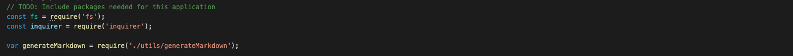
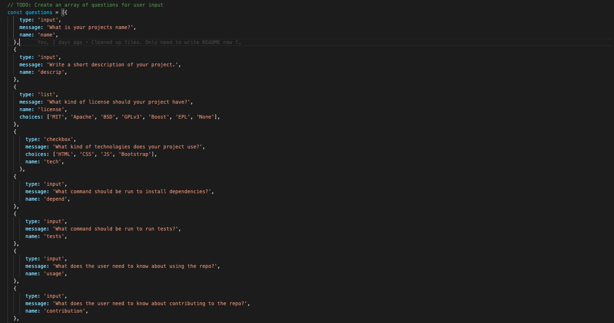
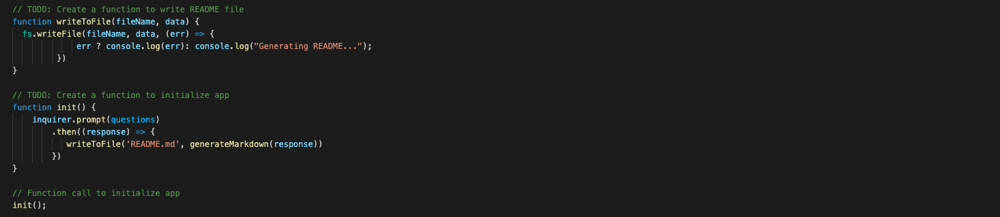
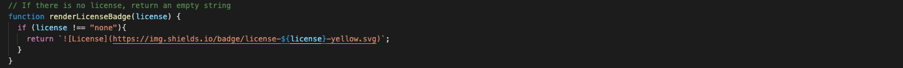
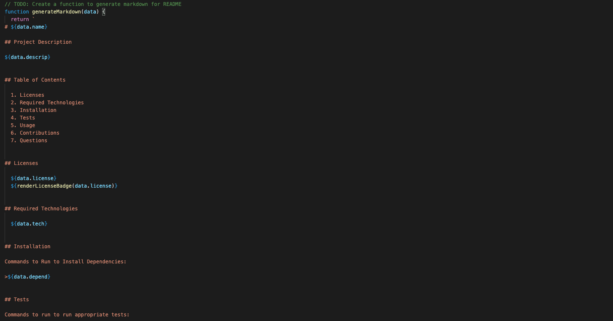

# README_Generator
Project Description: README Generator utilizing Node.js where a user is prompted for their project information and once that is done, a README is generated based on the information entered. This project is a command-line application that dynamically generates a professional README.md file from a user's input using the [Inquirer package](https://www.npmjs.com/package/inquirer).

The application will be invoked by using the following command:

```bash
node index.js
```
## User Story

```md
AS A developer
I WANT a README generator
SO THAT I can quickly create a professional README for a new project
```

## Acceptance Criteria

```md
GIVEN a command-line application that accepts user input
WHEN I am prompted for information about my application repository
THEN a high-quality, professional README.md is generated with the title of my project and sections entitled Description, Table of Contents, Installation, Usage, License, Contributing, Tests, and Questions
WHEN I enter my project title
THEN this is displayed as the title of the README
WHEN I enter a description, installation instructions, usage information, contribution guidelines, and test instructions
THEN this information is added to the sections of the README entitled Description, Installation, Usage, Contributing, and Tests
WHEN I choose a license for my application from a list of options
THEN a badge for that license is added near the top of the README and a notice is added to the section of the README entitled License that explains which license the application is covered under
WHEN I enter my GitHub username
THEN this is added to the section of the README entitled Questions, with a link to my GitHub profile
WHEN I enter my email address
THEN this is added to the section of the README entitled Questions, with instructions on how to reach me with additional questions
WHEN I click on the links in the Table of Contents
THEN I am taken to the corresponding section of the README
```

## Development Process

This project was developed using an index.js file with the usage of inquirer. 

First packages were installed and these needed to be assigned to variables in the script file, and also link the index.js to the generateMarkdown script file:



From here, we created an array to hold all of the questions for the user to answer in regards to their project. Here we are utilizing inquirer:



Then, lastly in the index. js file, we needed to create functions to initialize the app, and to actually write the user input data to the Markdown file (README) that we are generating:



Now, we needed to write the generateMarkdown script file to actually write the user input data to the README we are generating itself. The first function we write is to handle inserting license badges to the README based on the licenses the user indicated they used for their project: 



Now from here we are able to actually enter the content that we want to be displayed on the readme itself: 



## Credits

NPM Inquirer - [Inquirer](https://www.npmjs.com/package/inquirer)

## Links

GitHub Repository - [Code-Quiz Repository](https://github.com/ktrudickm/README_Generator "README Generator Repository")

Deployed Project - [Deployed Application](https://ktrudickm.github.io/README_Generator/ "Deployed Application")